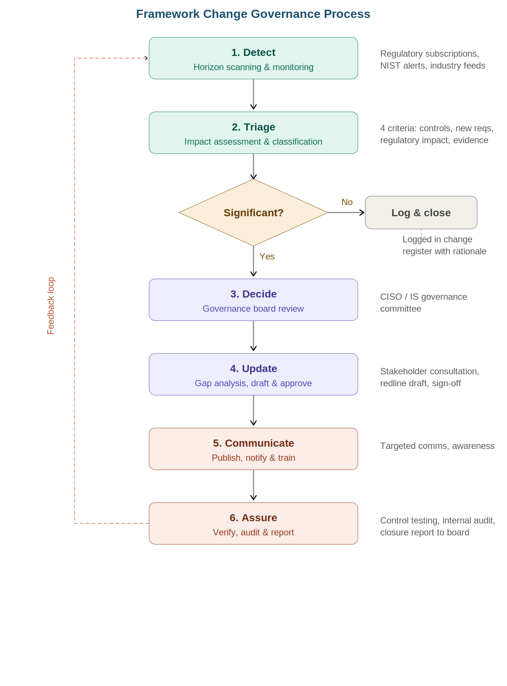

# Framework Change Governance Process

A structured governance process for systematically detecting, assessing, and responding to changes in cybersecurity frameworks and regulatory expectations — ensuring organisational policies remain current, aligned, and audit-ready.

Designed for **UK financial services** firms using **NIST CSF 2.0** as their primary cybersecurity framework, with extensibility to DORA, PRA/FCA supervisory expectations, ISO 27001, and other regulatory regimes.

---

## Process Flow

---

## The Problem

Cybersecurity frameworks and regulations don't stand still. NIST CSF moved from 1.1 to 2.0. DORA came into force. PRA and FCA regularly update supervisory expectations. Most organisations treat policy updates as reactive, ad hoc tasks — someone notices a change, flags it informally, and a policy gets updated months later with no audit trail.

This project provides a **repeatable, evidence-based governance process** that makes policy updates systematic rather than ad hoc, with clear accountability, tiered escalation, and a continuous feedback loop.

---

## How It Works

The process operates as a six-phase continuous cycle:

| Phase | Purpose | Key Activity |
|-------|---------|--------------|
| **1. Detect** | Know something changed | Horizon scanning, regulatory subscriptions, structured monitoring |
| **2. Triage** | Assess whether it matters | Impact assessment against four defined criteria, tiered classification |
| **3. Decide** | Get authority to act | Governance board review for significant changes |
| **4. Update** | Change the policies | Gap analysis, crosswalk mapping, stakeholder consultation, redline drafting |
| **5. Communicate** | Tell people what changed | Targeted rollout, training, policy publication |
| **6. Assure** | Confirm it's working | Compliance verification, internal audit, closure reporting |

All changes — regardless of significance — are logged in the **Framework Change Register**. Only significant changes require governance board approval. Low-impact changes are assessed and closed by the GRC team with documented rationale. This tiered model keeps governance practical without drowning in noise.

---

## What's Included

### 📄 Governance Process Document
`Framework_Change_Governance_Process.docx`

A comprehensive Word document covering:
- Purpose, scope, and governance principles (separation of duties, tiered escalation, continuous improvement)
- Full RACI matrix across all six phases
- Triage criteria with rating guidance (control mapping, new requirements, regulatory impact, evidence and reporting)
- Escalation matrix with timelines (Low / Medium / Significant)
- Detailed phase-by-phase process with objectives, activities, and outputs
- Worked scenario: NIST CSF 1.1 → 2.0 transition walkthrough
- Supporting artefacts list and document approval section

### 📊 Framework Change Register
`Framework_Change_Register.xlsx`

An operational Excel workbook with three tabs:
- **Change Register** — 23-column tracker covering detection through closure, with dropdown validations for consistency
- **Dashboard** — Formula-driven summary view (total changes, open/closed, breakdowns by rating and status)
- **Triage Criteria Reference** — Assessment criteria and escalation matrix built into the workbook for easy reference

The register includes three sample entries demonstrating how different types of changes are handled: a significant framework update (CSF 2.0), a low-impact regulatory clarification (PRA SS2/21), and a not-relevant supplementary publication.

---

## Triage Criteria

Every detected framework change is assessed against four criteria:

| Criterion | What It Asks |
|-----------|-------------|
| **Control mapping impact** | Does the change affect controls we already have mapped to our policies? |
| **New requirements** | Does the change introduce requirements not currently addressed? |
| **Regulatory impact** | Does it affect how we evidence compliance with PRA, FCA, or other obligations? |
| **Evidence and reporting** | Does it change how we report, measure, or evidence compliance? |

Each criterion is rated High / Medium / Low, producing an overall classification that determines the escalation route.

---

## Design Principles

**Separation of duties** — The team that detects and triages changes is not the team that approves policy updates. Detection sits with GRC; approval authority sits with the IS Governance Committee.

**Tiered escalation** — Not everything goes to the board. All changes are logged, but only significant ones need committee approval. This prevents governance fatigue.

**Evidence-based decisions** — Triage uses defined criteria, not subjective judgement. This ensures consistency and provides an auditable trail for regulatory scrutiny.

**Continuous improvement** — Assurance findings feed back into detection and triage. The process is a cycle, not a one-shot project.

---

## Scenario: NIST CSF 1.1 → 2.0

The governance document includes a full worked scenario demonstrating how the process handles the transition from NIST CSF 1.1 to 2.0:

- **Detect** — GRC analyst identifies the publication via NIST subscription alert and prepares a structured change brief
- **Triage** — All four criteria flag impact (new Govern function, restructured subcategories, indirect regulatory exposure, updated informative references) → classified as Significant
- **Decide** — IS Governance Committee approves a policy update programme with 90-day target
- **Update** — Crosswalk mapping, gap analysis (Govern function coverage gaps), redline drafting, stakeholder sign-off
- **Communicate** — Targeted briefings for control owners, senior leadership briefed on Govern function responsibilities
- **Assure** — Compliance verification at 90 days, internal audit inclusion, closure report to committee

---

## Applicable Frameworks

Designed primarily for NIST CSF 2.0, the process is framework-agnostic and extensible to:

- DORA (Digital Operational Resilience Act)
- PRA / FCA supervisory statements and expectations
- ISO 27001 / 27002
- NIST SP 800-53
- OWASP SAMM
- NIST Cyber Risk Institute (CRI) Profile

---

## Context

This project was developed as a portfolio piece demonstrating governance design capability at the intersection of cybersecurity GRC, regulatory compliance, and operational risk management within UK financial services.

---

## License

This project is provided for educational and portfolio purposes. You are free to adapt and use the templates for your own organisation's governance needs.
